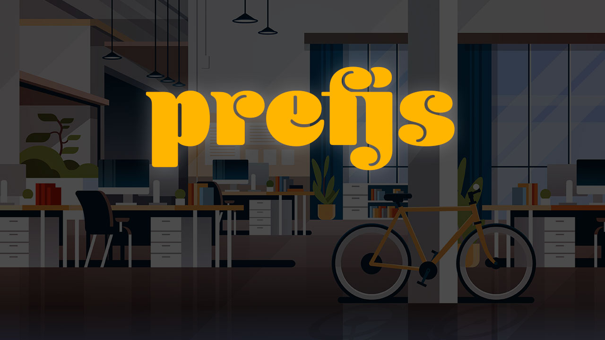

# `prefjs`



This package is meant for internationalization. It helps you define a JSON structure for different locales, and getting the right value back. For example, it could be used for the internationalization of a blog post.  

PrefJS can be used in NodeJS and in the browser, being compatible with all the frameworks, like: React, Angular, Vue, Ember, Next.js...

## Installing the package
```
$> npm install prefjs --save
```

If you are using Typescript, you will see the types information that comes bundled with this package when you are coding :). Enjoy!

## Localizing a blog post

First, let's create the blog post data.

```js
const PrefJS = require('prefjs');

const blogPost = {
  id: '123',
  en: {
    title: 'My title',
    config: {
      showImage: true,
    },
  },
  es: {
    title: 'Mi título'
  },
};
```
As you see, we have a blog post for english and spanish with the post title. Also, for english which is the default language we have a nested configuration to show an image.  

Now, let's create a new object with the default locale set to __en__, and the current locale set to __es__ assuming we are seeing that blog post in spanish.

```js
const pref = new PrefJS({ defaultLocale: 'en', currentLocale: 'es' });
```

After this we are going to set the data that we will be querying with PrefJS for the blog post
```js
pref.setGlobalData(blogPost);
```

Now, in order to get the title for the current locale (es), we would do:
```js
const title = pref.get('title'); // Mi título
```

PrefJS is smart enough to know that it should bring the post title for the current locale you are in. But what happens when we try to access a property that does not exist in spanish? PrefJS will return the value from the default locale. Example:
```js
const showImage = pref.get('config.showImage'); // true
```

And, what if the property does not exist in the current locale, nor in the default one? PrefJS can return a fallback value. Let's look at an example with the *postURL*, which is not set in any of the locales. Example:
```js
const fallbackValue = `https://my-domain.com/?id=${blogPost.id}`
const postURL = pref.get('postURL', fallbackValue); // https://my-domain.com/?id=123
```

The previous code snippet will first search in the currentLocale if __postURL__ existed, or will try to find it in the defaultLocale, and as it does not exist, it will return the fallbackValue provided.

### String formatting
Starting v1.0.0 you can use string formatting. For this we use the package `printj` (https://github.com/SheetJS/printj) so all its documentation applies.

For this feature, we created the function `getF`. Here is an example:

```ts
// Language data to use
const languageData = {
  en: {
    formattedString: 'This %s is formatted. Use it %s you need it'
  }
}

// Create the instance
const pref = new PrefJS({ defaultLocale: 'en', currentLocale: 'en' });

// Get a formatted string
const s = pref.getF('formattedString', 'Fallback', 'string', 'whenever, and however');
// s = This string is formatted. Use it whenever, and however you need it
```

As you can see, the second parameter is `"Fallback"`. This is a fallback string that can be used in the case in which the first argument given is not a value in the `languageData` you defined. This string is also formattable so you can expect the subsequent parameters to work fine. Example:

```ts
const s = pref.getF('i.dont.exist', 'Use this %s %s', 'string', 'as a fallback');
// s = Use this string as a fallback
```

Note: it also works with digits and it's possible to do other kinds of string manipulation. Please refer to the `printj` documentation for more.

## LICENSE
MIT.

## Credits
Juan Camilo Guarín Peñaranda  
Jamundí, Colombia  
2020